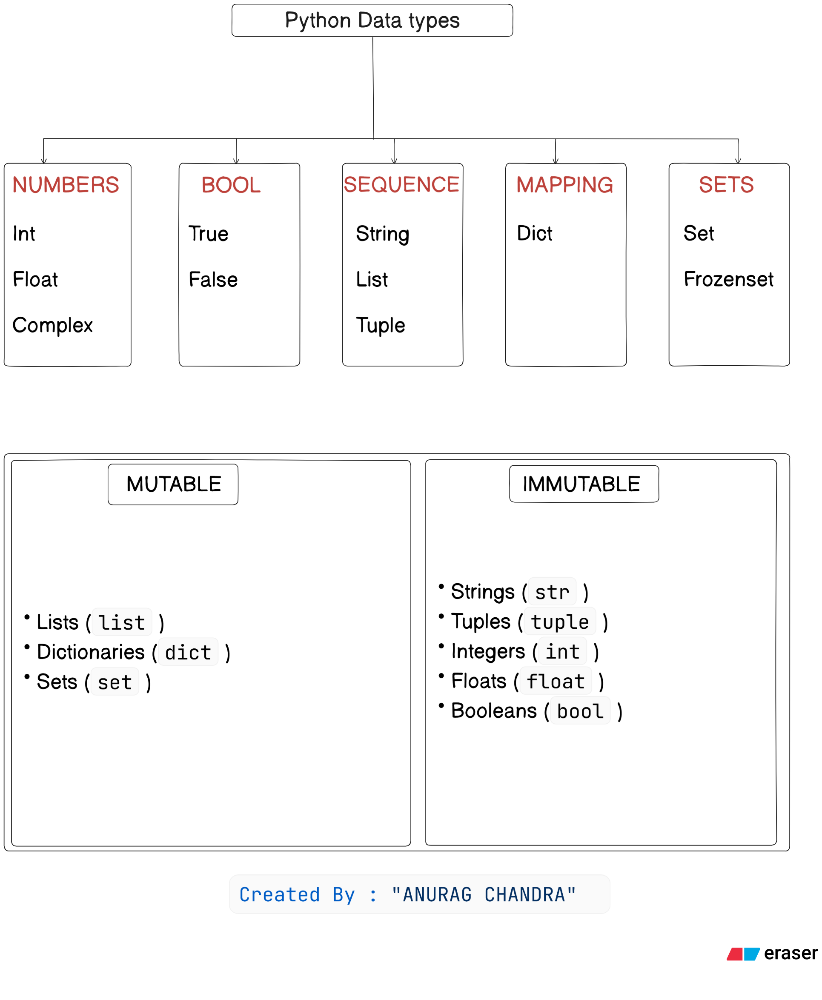

# Day 1 — Warm-up: Python Basics

## Topics Covered
- Hello world
- Data types
- Operators

## Observations
- Even with basics, dry runs help clarify logic.
- Type checking is useful for debugging and input validation.
- Loops and conditionals form the backbone of control flow.

---

Image: Data types in Python
