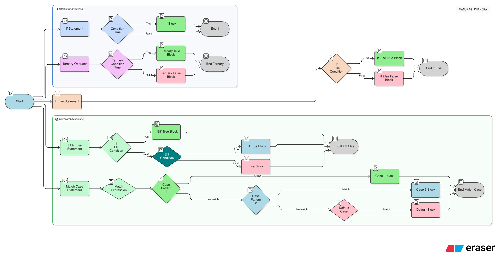

# Day 2 — Warm-up: Python Basics

## Topics Covered
- Type checking using `type()` and `isinstance()`
- Conditionals: `if`, `elif`, `else`
- Loops: `for`, `while`, `break`, `continue`

## Practice
- Wrote a function to reverse string.

## Observations
- Even with basics, dry runs help clarify logic.
- Type checking is useful for debugging and input validation.
- Loops and conditionals form the backbone of control flow.

---

Image: Conditionals in Python
