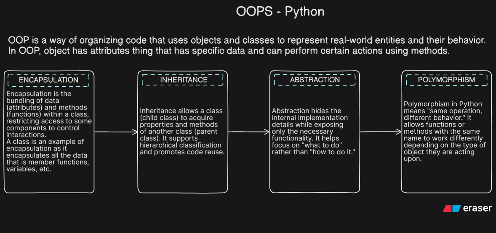

# DAY 8

## OOPS in Python



## What are Classes & Objects? Attributes vs. Methods

Classes and objects are fundamental concepts in Object-Oriented Programming (OOP). They provide a way to structure code in a modular and reusable manner.

### 🔹 Classes

- A class is a blueprint or a template for creating objects.
- It defines the attributes (data) and methods (behavior) that the objects of the class will have.

### Example:

```python
class Dog:
    def __init__(self, name, breed):
        self.name = name
        self.breed = breed

    def bark(self):
        return "Woof!"
```

### 🔹 Objects

- An object is an instance of a class.
- It is a concrete entity created based on the class blueprint.

```python
my_dog = Dog("Buddy", "Golden Retriever")
```

### Attributes vs. Methods

- **Attributes**: Variables that hold data about the object. They represent the state of the object.

- **Methods**: Functions that define the behavior of the object. They perform actions on the object's data.

_Example_:

```python
class Dog:
    def __init__(self, name, breed):
        self.name = name  # Attribute
        self.breed = breed  # Attribute

    def bark(self):  # Method
        return "Woof!"
```
